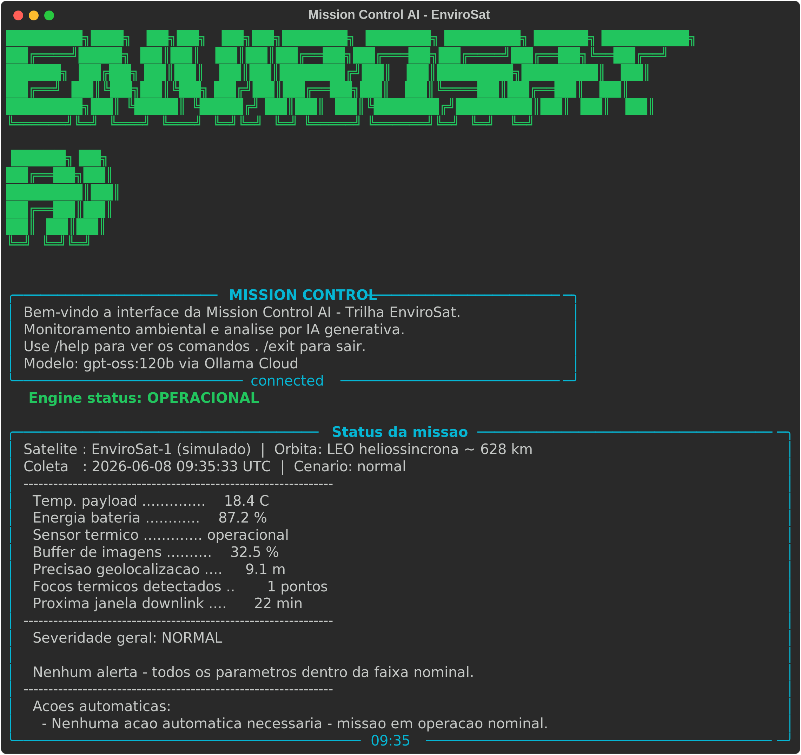
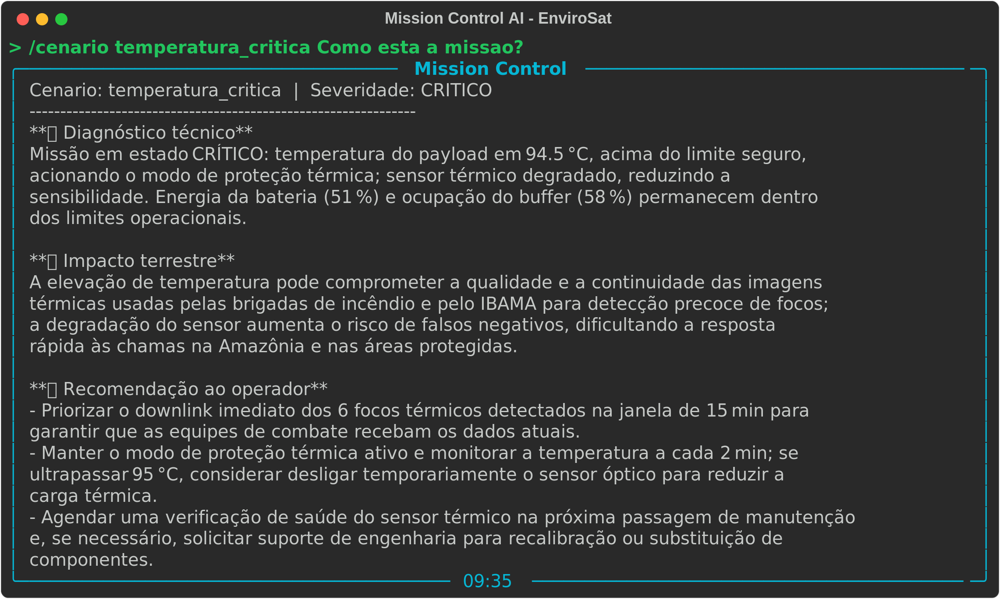

# 🚀 Mission Control AI — EnviroSat (Observação Ambiental)

Sistema de monitoramento operacional de um satélite ambiental simulado
(**EnviroSat-1**) que detecta anomalias via lógica Python e usa **IA generativa
(Ollama Cloud · gpt-oss:120b)** para analisar o estado da missão em linguagem
natural, traduzindo cada anomalia em **impacto terrestre** no combate ao
desmatamento e a incêndios.

> FIAP · Ciência da Computação · **Global Solution 2026.1** · Prompt Engineering and AI

## 👥 Integrantes

- Gabriel Lima da Silva — RM: _(568436)_ — Turma: _(1CCPR)_
- Nicolas Araujo de Oliveira — RM: _(566780)_ — Turma: _(1CCPR)_

**Modalidade:** Dupla

## 🛰️ O que o projeto faz

O EnviroSat-1 simula a telemetria de um satélite de observação ambiental
(sensor térmico + óptico, órbita LEO heliossíncrona ~628 km, inspirado no
Amazônia-1 e Landsat). A cada ciclo o sistema gera dados de 5 parâmetros,
aplica **regras de decisão (thresholds) em Python** para classificar a
severidade (`NORMAL` / `ATENCAO` / `CRITICO`), aciona **respostas automáticas**
de bordo (modo economia, downlink prioritário, failover de sensor etc.) e
injeta esses dados reais no prompt do **gpt-oss:120b**, que devolve um
diagnóstico técnico + o impacto ambiental terrestre + recomendações ao operador.

## 🎯 Persona atendida

**Operador do centro de controle ambiental (INPE / órgão estadual).** É quem
acompanha a telemetria sob pressão e precisa decidir rápido se um foco térmico
detectado vira despacho de brigada. A IA traduz o dado bruto orbital em decisão
terrestre acionável para esse perfil — e, por tabela, para coordenadores de
brigada e analistas de compliance ambiental.

## 🧰 Tecnologias utilizadas

- **Python 3.10+** (comentários em português)
- **Ollama Cloud API** — modelo `gpt-oss:120b`
- Bibliotecas: `ollama`, `python-dotenv`, `rich`, `prompt-toolkit`, `pyfiglet`

## ⚙️ Como executar

```bash
# 1. Clone o repositório
git clone https://github.com/GabrielLima2005/mission-control-ai.git
cd mission-control-ai

# 2. Crie e ative um ambiente virtual
python -m venv .venv && source .venv/bin/activate   # Windows: .venv\Scripts\activate

# 3. Instale as dependências
pip install -r requirements.txt

# 4. Crie o arquivo .env na raiz (copie de .env) com:
#    OLLAMA_API_KEY=29e4b61d6f7746b8957e0c137b4a5c38.TONdimglzNREs_fgPABUhQb6

# 5. Execute
python main.py
```

Dentro da CLI: digite uma pergunta (ex.: `Como está a missão?`) ou use
`/status`, `/help`, `/about`, `/cenario <nome>`, `/clear`, `/exit`.

## 🖼️ Demonstração




## 🧠 System Prompt

O system prompt completo está em [`prompts/system_prompt.md`](prompts/system_prompt.md).
Ele define papel (copiloto de operações do EnviroSat), escopo, restrições
(não inventar dados, não contradizer a severidade calculada em Python), tom,
**formato de saída fixo** e um exemplo **few-shot**.

### Iterações do prompt (processo)

- **v1** — genérico ("analise a telemetria"): respostas vagas, sem amarrar
  impacto terrestre. Descartado.
- **v2** — adicionado papel + persona + restrição de severidade: melhorou o
  foco técnico, mas o formato variava a cada chamada.
- **v3 (atual)** — formato de saída fixo (Diagnóstico / Impacto / Recomendação)
  + exemplo few-shot + `temperature=0.3`: respostas consistentes em ~3 execuções
  do mesmo cenário.

## 🧪 Cenários de teste demonstrados

1. **Operação normal** — todos os parâmetros dentro do range.
2. **Incêndio detectado** — muitos focos térmicos → protocolo de incêndio acionado.
3. **Temperatura crítica** — payload > 60 °C → modo proteção térmica.
4. **Energia baixa** — bateria < 20 % → modo economia (prioriza sensor térmico).
5. **Perda de comunicação** — sensor offline + buffer ~100 % → failover e downlink prioritário.

Os cenários têm valores fixos em [`data/cenarios.json`](data/cenarios.json) para
reprodutibilidade no vídeo (`/cenario <nome>`).

## 💼 Proposta de valor / modelo de negócio

1. **Problema terrestre que a missão resolve:** o Brasil perde milhares de km²
   de floresta por ano e os incêndios na Amazônia e no Cerrado se alastram em
   horas. Detecção tardia de focos significa área queimada maior, mais CO₂ e
   risco a comunidades. O EnviroSat encurta o tempo entre "satélite vê o foco" e
   "brigada é despachada".
2. **Quem paga:** modelo **híbrido**. O núcleo é **setor público** (INPE, IBAMA,
   defesas civis e secretarias estaduais de meio ambiente), com camada **privada**
   de dado-como-serviço para seguradoras rurais, certificadoras de crédito de
   carbono e gestores de áreas protegidas.
3. **Métrica de impacto (1 ano a 100 % de saúde):** monitoramento contínuo de
   ~**5 milhões de km²** de biomas brasileiros, com alertas de foco em **< 3 h**
   após a passagem — potencial de evitar a emissão de **centenas de milhares de
   toneladas de CO₂** ao antecipar o combate a incêndios.
4. **Modelo de negócio:** **Dado-como-serviço (DaaS)** por assinatura para os
   clientes privados, sustentado por **concessão/financiamento público** para a
   operação de base — o mesmo arranjo que viabiliza DETER/PRODES hoje.

## ⚠️ Limitações conhecidas

- A telemetria é **simulada** (plausível, não cientificamente exata).
- A detecção de focos é um número sintético, não processamento real de imagem.
- O sistema depende de conectividade com a Ollama Cloud; sem `OLLAMA_API_KEY` a
  CLI ainda roda a camada determinística (`/status`), mas sem análise da IA.
- Respostas do LLM são não-determinísticas; `temperature=0.3` reduz, mas não
  elimina, a variação.

## 🎬 Vídeo de demonstração

🔗 [Assistir demonstração no YouTube](https://www.youtube.com/watch?v=SEU_ID_AQUI)

> Configurado como "Não listado" no YouTube.
